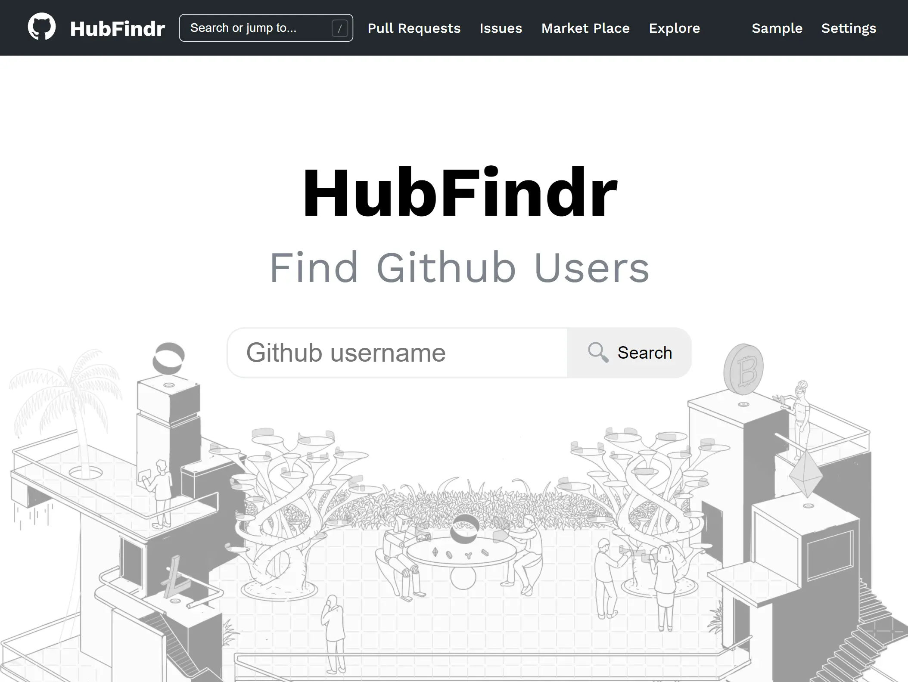

# HubFindr
A Github user search web app. My submission for the [@buycoinsafrica](https://buycoins.africa/) job application code challenge. Created by me - [Bankole Esan](https://twitter.com/codingInNeon).

(tldr; just [show me the app](https://bankole2000.github.io/hubFindr/index.html))

[](https://bankole2000.github.io/hubFindr/index.html)
[](https://bankole2000.github.io/hubFindr/index.html)
[](https://bankole2000.github.io/hubFindr/index.html)
[](https://bankole2000.github.io/hubFindr/index.html)

_<p align="center">"Never give up on something that you can't go a day without thinking about"</p>_ 

<p align="center" style="text-align: center;"><small >- Winston Churchill</small></p>

<div align="center" style="text-align:center; margin:auto;">
<a href="https://bankole2000.github.io/hubFindr/index.html"></a>
</div>

## What it is
A simple github user profile + repository search app, built to look and feel identical to the real thing. Built with:
* HTML
* CSS
* Javascript
* The [Github GraphQL API](https://docs.github.com/en/graphql/overview/explorer)
* [Passion](https://www.wikihow.com/Love-Programming) - (for the love of coding and hopefully to get the job)

## Challenge Requirements

#### What SHOULD be included:
- [x] A page with an input that takes a Github username
- [x] Submitting that input should load the profile page for the specific user
- [x] The responsive design of the site. Make your recreation as close to the real website as possible
- [x] The profile picture and basic description of the account 
- [x] 20 repositories (maximum)
- [x] The appearance of the input page should match the style of the profile page
- [x] A Good User experience

An example of what the [final result should look like](https://www.google.com/url?q=https://res.cloudinary.com/bitkoin/image/upload/v1605131940/frontend_dev_example.png&sa=D&source=editors&ust=1621893996578000&usg=AFQjCNFF_Mq5r4z5YfBfAEHOl0DLJdJykg)

#### What SHOULD NOT be included:
- [x] Pagination/Search Functionality - should include the first 20 repositories only
- [x] The other tabs (i.e. Overview, Projects, Packages)
- [x] The graph showing year of activity for the repository

#### Other requirements
- [x] Do not use any CSS or JS Framework
- [x] Host your site somewhere (Netlify or Github pages)

## Project Structure 
```scss
/HubFindr
  |--404.html // For users not found
  |--app.js   // Main profile page logic
  |--index.html // Home page 
  |--profile.html // Profile+Repo results page
  |--README.md  
  |--styles.css // holds majority styles
  |--/css
  |   |--spinner.css // loader
  |   |--/fonts   // Imported Fonts
  |      |--Segoe UI Bold.woff
  |      |--Segoe UI.woff
  |--/js 
  |   |--gql.js  // Holds query and Enum map objects
  |   |--home.js  // Home & 404 page logic
  |   |--settings.js // barely used this 
  |   |--UI.js // Class for rendering UI
  |   |--utils.js // Helper functions
  |--/.vscode
      |--settings.json // some personal ide settings
```

## Extra Features 
These were not specified in the requirements but they made sense to me so I thought to add them.

> Pls note: In a real-world project / job scenario, I would be sure to communicate with relevant personnel extensively before taking such liberties, unless expressly allowed to do so, as I am of the opinion that this is the right thing to do.

- [x] 404 page when user not found. (a given, doesn't need to be stated imho)
- [x] Page Transitions (for a smoother User experience)
- [x] **All** relevant links should go where they normally would on the ***actual*** website. Such links open in a new tab to indicate their externality (and for a better UX imho)
- [x] Retry button to handle internet connection errors 
- [x] Functional navbar input to quick search for users on all pages.
- [x] Focus on navbar search input on `/` key press (with simple micro-interaction animation). Blur on `Escape` key.
- [x] Input submissions on `Enter` key
- [x] Search modal available on smaller / mobile devices
- [x] Settings modal to allow user change gql variables: This means you can do things like: 
  - [x] Find a Users most starred repo, 
  - [x] Search for repos alphabetically, by creation date, by last pushed etc, 
  - [x] Recieve results in ascending or descending order
- [x] Social Share cards for twitter and facebook.
- [x] Use images from the buycoinsafrica website to express my enthusiasm for the role
- [x] Comment code for readability
- [x] `README.md` documention

## Applied Concepts
None of these are new concepts to me. Just the specific ones I used this particular project
* HTML5 Semantic tags
* DOM Manipulation & Traversal
* Event Handing & Delegation
* Template Strings and dynamic templating
* Fetch API 
* Local Storage
* GraphQL (Querying and query variables)
* ES6 Classes
* Imports and Exports (yes, you can actually do that in vanilla JS too, lol😂)
* Error Handling
* Intersection Observer
* Asynchronous programming
* Url Parameters and Dynamic routing
* CSS Variables
* CSS Specificity
* CSS Positioning
* FlexBox
* SVG Icons (symbol referencing and styling)
* `@media` Breakpoints (major and minor)

## Deliberate Omissions. 

<small>(i.e. possible enhancements / future development / rationales)</small>

Notable (but deliberate) ommissions with reasons: 
* **JS/CSS Minification** - Normally I would do this, but I imagined that the code would be inspected, and thus decided against it.
* **Form Validation** - Ideally, users shouldn't be able to submit required input fields empty - ***But*** (4 reasons): 
  1) There is a profile with the unlikely username `null`, and I figured this would be an interesting find/experience for users. This `null` user also doubled as a the `sample` profile on the website.
  2) Allowing empty search inputs eliminated the need for hinting, error/success messages, alerts etc - making a more seamless experience imho.
  3) I wanted to make the 404 page easier to reach. And 
  4) (Most importantly) this is the behaviour of the actual github website. All search fields can be submitted blank/empty (try it).
* **Fonts**: The Gihub website uses the Segoe UI font. This was not the font I originally used, due to my general preference for google fonts, and is probably the most significant difference between the **HubFindr** profile page and the actual github website. ***Update***: Decided to change it to segoe just to be more similar 
* **Dark Mode**: I could have implemented this fairly easily (and I imagine some other challenge entries probably would/did), but I decided against it so as not to come off as being overly extravagant/pedantic.

## Known Bugs / Issues
1. Firefox captures `/` keypress by default (for quick search). This negatively affects overall UX imho.
2. When searching for repos in order of `pushed at`, dependabot pushes on forks tend to skew results. Query and data are accurate, just unexpected.

## Some Notes
- **Early Submission** : I could have submitted this much earlier (completed the basic requirements roughly 3 days after I became aware of the challenge, *24th May*, became aware on the *21st*), but I thought to leverage the extra time to implement the extra features and take notes.
- **Missing profile data**: I tried adding the `Achievements` section to the user profiles, but couldn't (for the life of me) find the field with the relevant data on the api. This step also prevented me from adding the rest of the profile data (organizations etc), as well as the `Block or Report` link so as not to distort the 1:1 replication.
- **API Security**: To handle the `token` security issue, I used a personal 3rd party api (one of my own creation) so the **HubFindr** site could run on github pages. Ideally, this would be handled with *environmental variables*, an *OAuth server*, or some other kind of client authentication mechanism. I felt uneasy about this, but I believe doing so is/was well within the specified requirements.
- Room for improvements: The CSS is a bit messy. Too many inline styles especially in template strings. Navbar input and mobile Footer styling could be better (i.e. more similar to Github's). Navbar input animation is jittery sometimes.

## Contribution
This is a solo project. And will be shared publicly **only** after the submission deadline (31st May 2021).

## Acknowledgments

* Many thanks to [@ireade](https://github.com/ireade) for this pretty cool challenge - and for the possibility of working with her and the team at buycoinsafrica.
* Thanks to [@buycoinsafrica](https://github.com/buycoinsafrica) for the opportunity. It's been my dream to work remotely doing what I love (coding), and getting this job would literally be a dream come true for me. I would be deeply grateful for your kind consideration. 
* In the (_very_) unfortunate but understandable event that I am not selected for the role, I would deeply appreciate any feedback on how to improve not only with regards to this project / job application, but also as a developer in general. I would also appreciate consideration for any other roles that may be available, you may be aware of, or that you believe I would be suited for.
* And if you reached this point, thank you so much for checking out **HubFindr**, and never forget how _awesome_ you are. I wish you luck on your journey, and please wish me success in my job search and software/dev career. Thanks for reading 😊.

That being said
_<p align="center">Adieu, I return to my search for truth and mastery 🙏</p>_